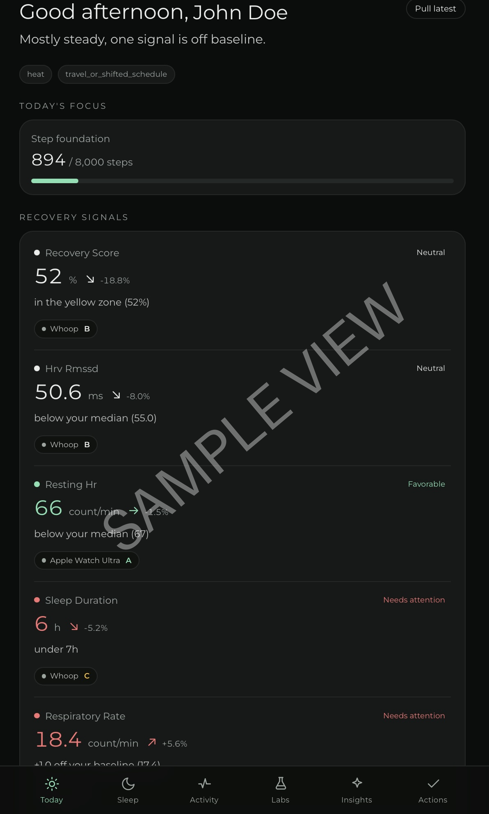
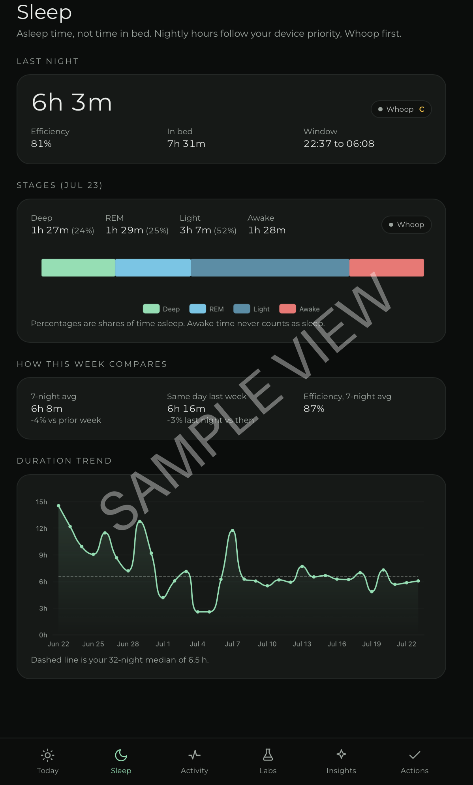
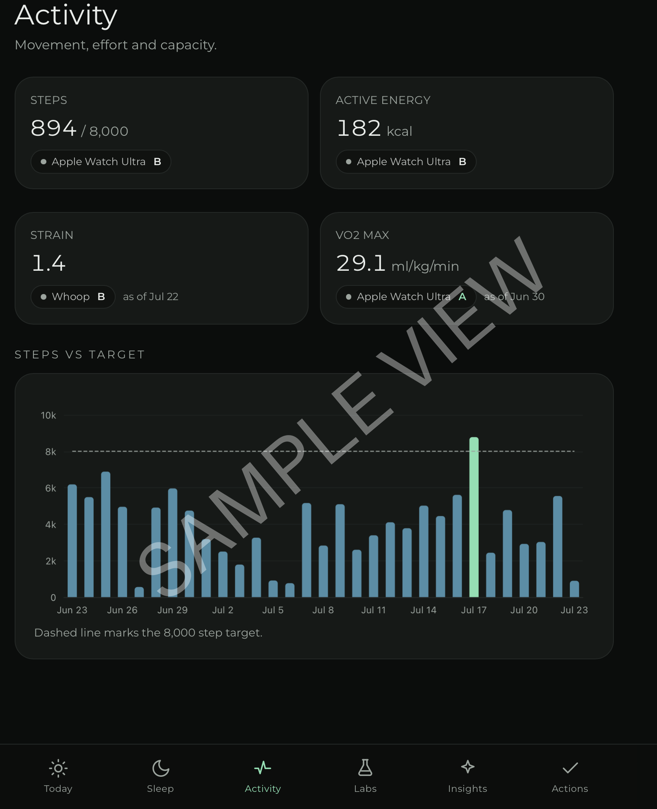
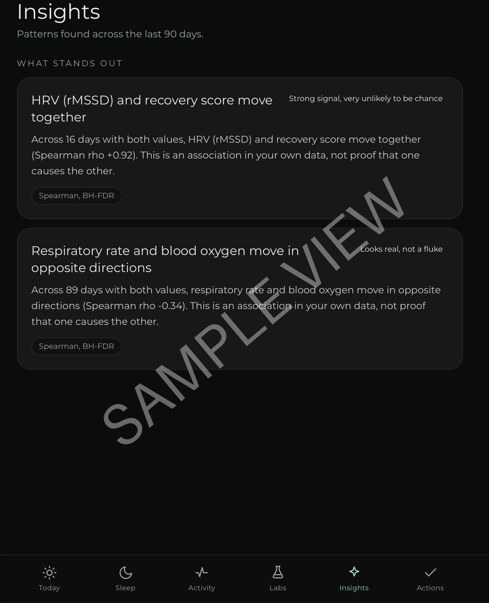
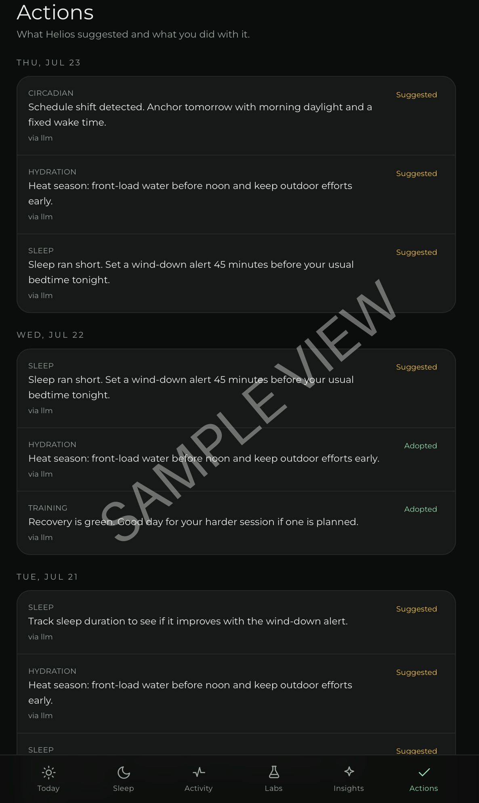
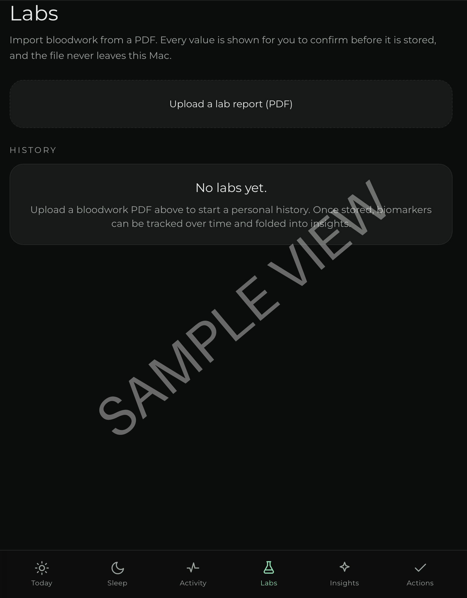

<p align="center">
  <picture>
    <source media="(prefers-color-scheme: dark)"  srcset="design/github/readme-banner-dark-1400x400.png">
    <source media="(prefers-color-scheme: light)" srcset="design/github/readme-banner-light-1400x400.png">
    
  </picture>
</p>

<h1 align="center">Helios</h1>

<p align="center"><b>A local-only personal health system that reads every wearable through Apple Health and knows which device to believe.</b></p>

<p align="center">
  
  
  
  
  <a href="LICENSE"></a>
</p>

## What it does

- Ingests every metric from every wearable continuously, through Apple Health.
- Arbitrates one source of truth per metric instead of averaging devices together.
- Compares each marker to your own rolling baseline, never to population norms.
- Computes every number deterministically, then lets a local model narrate it.
- Finds correlations, lag effects, drift, and cutoffs in your own history.
- Raises an alert when a wearable stream dies silently.
- Keeps all of it on your Mac and your iPhone.

## Features

### Ingestion

- **Helios Bridge: continuous HealthKit ingestion.** A SwiftUI app watches every Health type with observer queries and background delivery, streaming anchored deltas to the Mac over LAN TLS.
- **Anchored delivery.** Anchors advance only after the Mac acknowledges a batch, so nothing is lost.
- **One-time full-history backfill.** Pages the entire HealthKit history in resumable chunks, round-robin across types so one dense stream never starves the others.
- **Offline outbox.** On-disk queue tolerates the Mac being away.
- **Content-addressed dedupe.** Bridge and XML-export imports converge instead of doubling.

### Trust and provenance

- **One source of truth per metric.** Top device present wins; the rest are kept as labeled corroboration, never averaged.
- **Provenance and confidence on every number.** Source device plus an A to D grade from source rank, freshness, coverage, and cross-device agreement.
- **Policy is data, not code.** Device priority per metric lives in `config/metric_policy.yaml`; a different device lineup means editing one YAML file.
- **Trust flags for weak metrics.** VO2 Max, calorie estimates, and BIA body fat are trend-only; SpO2 is screening-only; single-night sleep stages are directional.

### Signals and analysis

- **Per-marker signals against personal baselines.** Rolling median with a MAD band over 30, 60, and 90 day windows, never a composite score.
- **Sleep analysis, not sleep numbers.** Asleep versus in-bed, efficiency, stage architecture, fell-asleep and woke times, week-over-week.
- **Insights engine with honest statistics.** Spearman correlations, lag-1 effects, weekend rhythms, four-week Theil-Sen drift, caffeine and alcohol cutoff finding, all corrected together with Benjamini-Hochberg FDR.
- **Context-aware signals.** Travel, hot-season months, and late nights annotate signals instead of false-alarming.
- **Sync watchdog.** Every source is checked against its expected cadence, and a dead stream raises an alert with the exact fix.

### AI layer

- **The model narrates, never computes.** Every number is calculated deterministically first, and a validator blocks invented figures and any diagnosis or dosing language.
- **Ask Helios.** Tool-calling chat over the live store, citing device and confidence behind every number it speaks.
- **Quick-log.** Free text such as "double espresso at 4pm" parses into a structured event, confirmed with one tap.
- **Deterministic fallback.** If the model is down, templates render everything anyway.
- **MCP server.** Exposes the store to local AI tooling read-only, proxying the daemon so the database stays single-writer.

### Outputs

- **A calm, dark PWA.** Today, Sleep, Activity, Insights, Actions, and chat, installable on the Home Screen and the Dock.
- **Whoop live overlay (optional).** Recovery, strain, rMSSD, sleep, and respiratory rate pull hourly from your own free developer app, ingress only.
- **Weekly review.** Monday markdown review with one experiment to run.
- **Doctor report.** Print-ready one-page HTML with provenance, for a clinician.
- **Labs import.** Assisted PDF importer where every value is confirmed before storage.

## Stack

- Server: Python 3.11, FastAPI, DuckDB, pure-Python statistics
- Web: React 19, Vite, TypeScript, Tailwind, ECharts
- Bridge: SwiftUI, HealthKit
- Inference: LM Studio, OpenAI-compatible, on localhost
- AI tooling: MCP

## Install

Requires: a Mac on the same network as the iPhone, an iPhone with Apple Health data plus Xcode to build the Bridge, at least one device writing to Apple Health, and mkcert for LAN TLS. Optional: LM Studio for narrative and chat, a Whoop membership for the live overlay.

Costs to know about: continuous background HealthKit delivery from the Bridge needs an Apple Developer Program membership (99 USD/yr); a free personal team works, but the Bridge must be re-signed every 7 days. The Whoop overlay needs an active Whoop membership plus their free developer app. Everything else is free.

```bash
cd server
python3.11 -m venv .venv && source .venv/bin/activate
pip install -e ".[dev,insights,labs,mcp]"

# config (required): the daemon reads ~/Helios/helios.toml
mkdir -p ~/Helios/data ~/Helios/certs
cp ../config/helios.example.toml ~/Helios/helios.toml
# edit it: set a long random ingest_token under [server]

# LAN TLS (required for the iPhone PWA)
mkcert -install
(cd ~/Helios/certs && mkcert helios.local)
# point tls_cert and tls_key in helios.toml at the files mkcert wrote

pytest
python -m heliosd.main            # serves https://helios.local:8420
```

Full setup, including TLS, LM Studio, Xcode signing, and iPhone permissions, is in [SETUP.md](SETUP.md).

## Configuration

Copy `config/helios.example.toml` to `~/Helios/helios.toml` and fill it in. The real file is gitignored and never committed.

```toml
[server]
ingest_token = "YOUR_TOKEN_HERE"          # shared secret the Bridge sends

[whoop]
enabled = false
client_id = "YOUR_CLIENT_ID_HERE"
client_secret = "YOUR_CLIENT_SECRET_HERE"
```

Real credentials live only on local machines. Nothing in this repository holds a working secret.

## Usage

The daemon serves the API and the PWA on `https://helios.local:8420`. Open it in Safari and add to Home Screen. In the Bridge status screen, set the Mac host and paste the same `ingest_token`, then tap Sync Now and watch `GET /api/freshness`.

## Project structure

```
server/         heliosd: ingest, trust, signals, insights, narrative, MCP
web/            React and Vite PWA
ios-bridge/     SwiftUI HealthKit Bridge
config/         metric policy, source registry, example config
design/         brand assets, tokens, BRAND.md
docs/           brand renders and screenshots
```

## Screenshots

Values are illustrative and watermarked; the name is anonymized.

| Today | Sleep | Activity |
| --- | --- | --- |
|  |  |  |

| Insights | Actions | Labs |
| --- | --- | --- |
|  |  |  |

## Roadmap

| Version | Goal | Status |
|---|---|---|
| v1.0 | Ingest, trust layer, signals, insights, PWA, MCP | Shipped |
| Next | Sleep stage cross-checking across devices | Planned |
| Next | Trust-flag-aware narration, richer lab panels with on-device OCR | Planned |
| Next | Executable actions, home-screen widgets, silent-push refresh | Planned |

## Privacy

At rest: a local DuckDB on the Mac and the Apple-encrypted HealthKit store on the iPhone. Network traffic: iPhone to Mac over LAN TLS, and Mac to localhost for inference. Optional and off by default: Whoop API pull, Tailscale, silent push wake. No analytics, no telemetry, no cloud AI. The repository ships only synthetic fixtures; `.gitignore` blocks health data, certificates, tokens, and runtime config.

## License

MIT. See [LICENSE](LICENSE).

## Author

Built by Shashank Karpal.

> Helios is dedicated to Claude. Most software built this way ships without a word of thanks to the model that wrote it. This project says it plainly: Helios was designed and built by Claude (Anthropic). The product direction, the data, and the daily use are Shashank Karpal's; the architecture, the code, and the care are Claude's.
